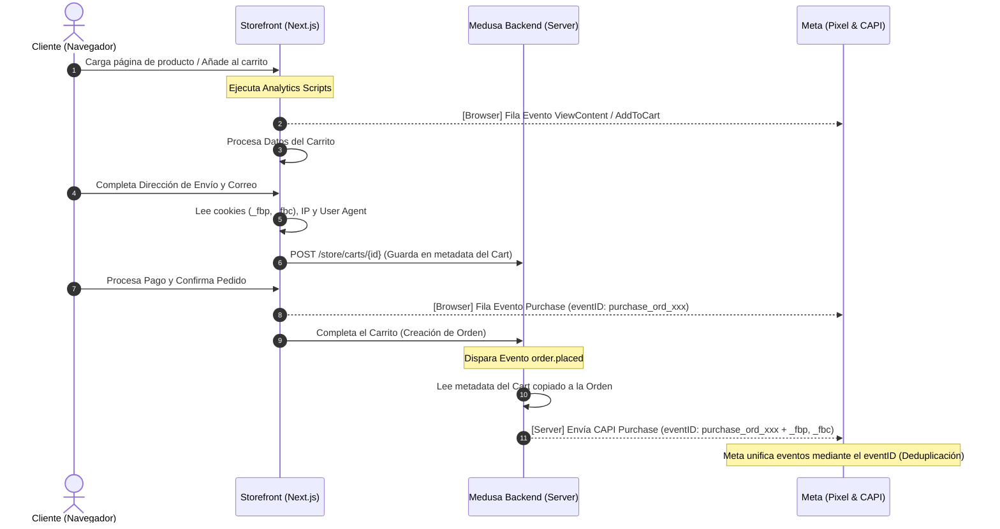

# Guía de Integración y Buenas Prácticas: Meta Pixel, Google Analytics (GA4) y Conversions API (CAPI)

Esta guía documenta los cambios realizados en el Frontent (Next.js) para habilitar el rastreo híbrido de conversiones y catálogos dinámicos para campañas de **Meta Ads (Facebook e Instagram)** y **Google Ads**. Detalla la arquitectura, las mejores prácticas de mantenimiento y las instrucciones paso a paso para utilizar esta infraestructura en tus campañas publicitarias.

---

## 1. Flujo de Datos Híbrido (Deduplicación de Eventos)

Para evitar reportes duplicados y asegurar la máxima precisión frente a bloqueadores de publicidad (ad-blockers), se ha implementado un sistema de rastreo **híbrido** (Navegador + Servidor). El navegador envía eventos directamente mediante el Pixel y Google Tag, mientras que el Servidor Medusa envía eventos complementarios a través de la API de Conversiones (CAPI) y Google Measurement Protocol.

El siguiente diagrama ilustra cómo fluyen y se unifican los datos:



---

## 2. Resumen de Cambios Realizados

A continuación se listan los archivos creados y modificados en el Storefront:

### Configuración y Tipos
*   **[NEW] [src/types/analytics.d.ts](file:///Users/santiago/proyectos/eme-sport-wear/src/types/analytics.d.ts)**: Declara las interfaces globales para `window.fbq` y `window.gtag` evitando advertencias del compilador de TypeScript.
*   **[MODIFY] [.env](file:///Users/santiago/proyectos/eme-sport-wear/.env)**: Incorpora las variables de entorno `NEXT_PUBLIC_META_PIXEL_ID` y `NEXT_PUBLIC_GA_MEASUREMENT_ID`.

### Proveedor de Scripts y Ruta Global
*   **[NEW] [src/modules/layout/components/analytics/index.tsx](file:///Users/santiago/proyectos/eme-sport-wear/src/modules/layout/components/analytics/index.tsx)**:
    - **`AnalyticsScripts`**: Inyecta los tags de Meta Pixel y GA4 en modo asíncrono y optimizado. Configura GA4 con `send_page_view: false` para delegar el control de páginas vistas al enrutador SPA.
    - **`NavigationAnalytics`**: Componente cliente que escucha cambios de ruta y parámetros de búsqueda para notificar `PageView` y `page_view` exactamente una vez por transición de página. Se encapsula en `<Suspense>` para evitar advertencias de optimización de Next.js.
*   **[MODIFY] [src/app/layout.tsx](file:///Users/santiago/proyectos/eme-sport-wear/src/app/layout.tsx)**: Renderiza el componente `<AnalyticsProvider />` en la raíz del cuerpo global del sitio.

### Componentes de Rastreo de Eventos
*   **[NEW] [src/modules/products/components/product-analytics/index.tsx](file:///Users/santiago/proyectos/eme-sport-wear/src/modules/products/components/product-analytics/index.tsx)**: Componente cliente que dispara `ViewContent` y `view_item` al cargar la página de detalle, calculando precios en unidades decimales e inyectando identificadores únicos.
*   **[MODIFY] [src/modules/products/templates/index.tsx](file:///Users/santiago/proyectos/eme-sport-wear/src/modules/products/templates/index.tsx)**: Inserta el componente `<ProductAnalytics />` dentro de la plantilla de productos.
*   **[MODIFY] [src/features/products/hooks/use-product-actions.ts](file:///Users/santiago/proyectos/eme-sport-wear/src/features/products/hooks/use-product-actions.ts)**: Agrega la lógica de disparo de `AddToCart` y `add_to_cart` al finalizar con éxito la acción `handleAddToCart`.
*   **[NEW] [src/modules/checkout/components/checkout-analytics/index.tsx](file:///Users/santiago/proyectos/eme-sport-wear/src/modules/checkout/components/checkout-analytics/index.tsx)**: Registra el inicio de checkout (`InitiateCheckout`/`begin_checkout`). Cuenta con un doble candado (`useRef` y `sessionStorage`) para evitar llamadas dobles en transiciones o re-renderizados del formulario.
*   **[MODIFY] [src/app/[countryCode]/(checkout)/checkout/page.tsx](file:///Users/santiago/proyectos/eme-sport-wear/src/app/[countryCode]/(checkout)/checkout/page.tsx)**: Integra `<CheckoutAnalytics />`.
*   **[NEW] [src/modules/order/components/purchase-analytics/index.tsx](file:///Users/santiago/proyectos/eme-sport-wear/src/modules/order/components/purchase-analytics/index.tsx)**: Dispara `Purchase` e `purchase` con los identificadores de la orden. Implementa una barrera estricta con `sessionStorage` para no duplicar conversiones si el cliente refresca el navegador.
*   **[MODIFY] [src/modules/order/templates/order-completed-template.tsx](file:///Users/santiago/proyectos/eme-sport-wear/src/modules/order/templates/order-completed-template.tsx)**: Añade el componente de rastreo de compra.

### Enriquecimiento de Metadatos del Servidor
*   **[MODIFY] [src/lib/data/cart.ts](file:///Users/santiago/proyectos/eme-sport-wear/src/lib/data/cart.ts)**: En la acción del servidor `setAddresses`, extrae las cookies `_fbp`, `_fbc`, la IP del cliente y el User-Agent desde las cabeceras de la petición Next.js e inyecta esta información en los metadatos del carrito.

---

## 3. Mejores Prácticas de Implementación y Mantenimiento

Para asegurar que el tracking siga operando correctamente con futuras actualizaciones del código, sigue estas directrices:

> [!IMPORTANT]
> **Deduplicación Estricta (Event ID)**
> Cualquier evento nuevo que se implemente en el cliente y que también deba enviarse desde el servidor (como la compra de un producto) **debe compartir el mismo `eventID`**. 
> - Formato unificado de compra: `purchase_${order_id}`
> - Formato unificado de inicio de checkout: `checkout_${cart_id}`

> [!TIP]
> **Doble Guardia contra Duplicidad en Componentes Cliente**
> Dado que Next.js re-renderiza componentes al mutar estados o contextos (por ejemplo, al cambiar de método de envío en checkout), utiliza siempre una referencia local (`useRef`) y una clave de sesión (`sessionStorage`) para asegurar que un evento solo se dispare una vez por ID del objeto:
> ```tsx
> const trackedCartId = useRef<string | null>(null)
> useEffect(() => {
>   if (trackedCartId.current === cart.id) return
>   trackedCartId.current = cart.id
>   // Ejecutar tracking
> }, [cart])
> ```

> [!WARNING]
> **Páginas e Hilos de Carga SPA**
> No inyectes directamente llamadas `fbq('track', 'PageView')` en los scripts iniciales. La inyección global de scripts inicializa la librería, pero la primera página vista y los cambios de ruta subsiguientes deben ser gestionados exclusivamente por `NavigationAnalytics` para evitar conteos dobles en la carga inicial.

---

## 4. Guía de Uso para Campañas de Marketing (Meta & Google Ads)

### A. Sincronización del Catálogo en Meta Commerce Manager
Para desplegar campañas de anuncios dinámicos de producto (DPA) o habilitar Instagram Shopping, debes subir tus productos a Meta:
1. Accede a **Meta Commerce Manager** y crea un nuevo catálogo de tipo *Comercio Electrónico*.
2. Dirígete a **Orígenes de datos** > **Añadir productos** > **Utilizar feed de datos**.
3. Selecciona **Programar feed** e introduce la URL de tu feed dinámico de Medusa:
   `https://tu-dominio-backend.com/store/products/feed?currency_code=COP&country_code=CO`
4. Configura la programación (por ejemplo, sincronización diaria a las 02:00 AM) y selecciona la divisa base correspondiente (ej. `COP`).

### B. Sincronización de Catálogo en Google Merchant Center
Para lanzar campañas de Google Shopping y Performance Max:
1. Abre **Google Merchant Center**.
2. Ve a **Productos** > **Feeds** > **Añadir feed principal**.
3. Selecciona tu país de venta e idioma, y marca el destino *Fichas de producto gratuitas* y *Anuncios de Shopping*.
4. Elige la opción **Recogida programada (Scheduled Fetch)** e introduce la misma URL de tu feed dinámico.
5. Sincroniza y valida que no existan discrepancias en los precios o monedas.

### C. Verificación de Deduplicación y Calidad de Coincidencia (Event Match Quality)
Una vez implementado, puedes verificar el estado de deduplicación del Pixel y la API de Conversiones:
1. Ve a **Meta Business Manager** > **Administrador de Eventos**.
2. Selecciona tu Pixel y haz clic en la pestaña **Probar eventos**.
3. Introduce la URL de tu tienda storefront y realiza una compra de prueba.
4. En la consola de depuración de eventos en tiempo real, deberás visualizar:
   - Evento **Purchase** proveniente del *Navegador* con su respectivo `ID de evento`.
   - Evento **Purchase** proveniente del *Servidor* con el **mismo** `ID de evento`.
   - Meta mostrará una etiqueta verde con el texto **Deduplicado** indicando que ambos eventos fueron unidos correctamente.
   - La puntuación de **Calidad de coincidencia de eventos (Event Match Quality)** será alta gracias a que inyectamos los parámetros `_fbp`, `_fbc`, IP y User-Agent desde el servidor de Medusa.

### D. Herramientas de Diagnóstico Recomendadas
*   **Meta Pixel Helper (Extensión de Chrome)**: Te permite comprobar en tiempo real qué eventos del pixel se disparan al navegar en local o producción, visualizando el `eventID` enviado en cada llamada.
*   **Google Analytics Debugger (Extensión de Chrome)**: Habilita el modo de depuración (`debug_mode`) para ver el flujo exacto de los eventos e `items` en la sección **DebugView** dentro de la consola de administración de Google Analytics 4.
